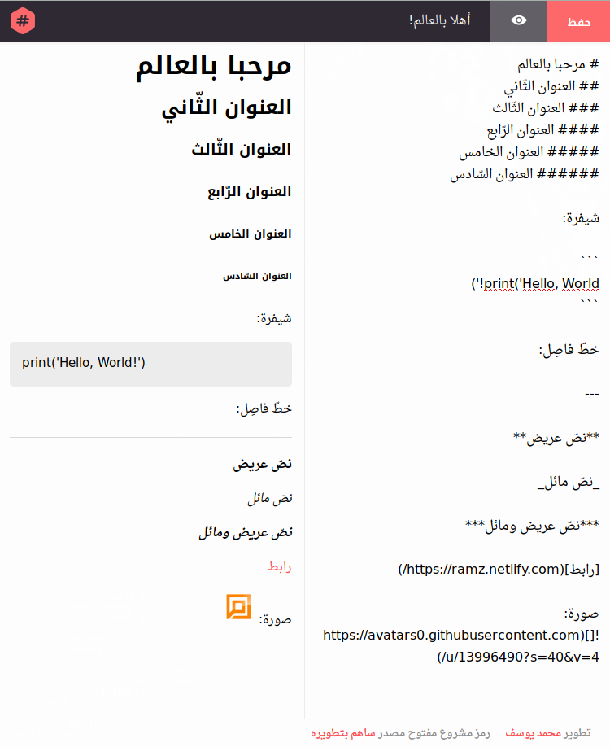

# Ramz
> Markdown editor that understands Arabic
‏مُحرّر ماركداون يفهم اللغة العربيّة
[https://ramz.netlify.com](https://ramz.netlify.com/)

### Features | المُميّزات
- Export files as txt/HTML
- ‏ HTML و txt تصدير الملفّات بصيغتي
- Live preview
- العرض الحيّ للتّعديلات
- Clean design
- تصميم أنيق
- RTL writing direction
- دعم الكتابة من اليمين إلى اليسار
- More is coming!
- والمزيد قادم

### Used resources
- [Shawdown](https://github.com/showdownjs/showdown)
- [React](https://github.com/facebook/react)

### Development
First make sure that [node.js](https://nodejs.org) and [npm](https://www.npmjs.com/) are installed on your device. 
then run:

    npm install

To install dependencies from `package.json` file.
Run the development server with hot reload at [localhost:8080](localhost:8080):

    npm start

To build run:

    npm run build

That is it, happy coding :)
